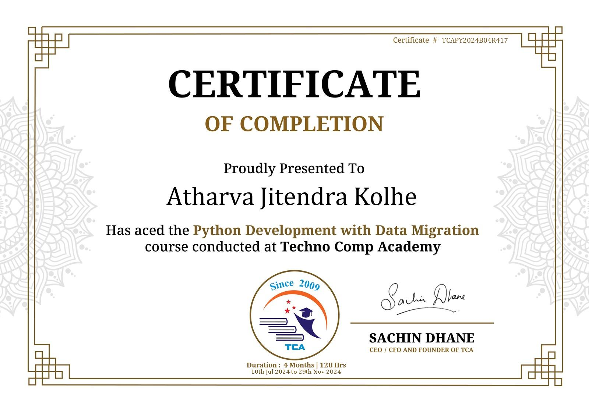
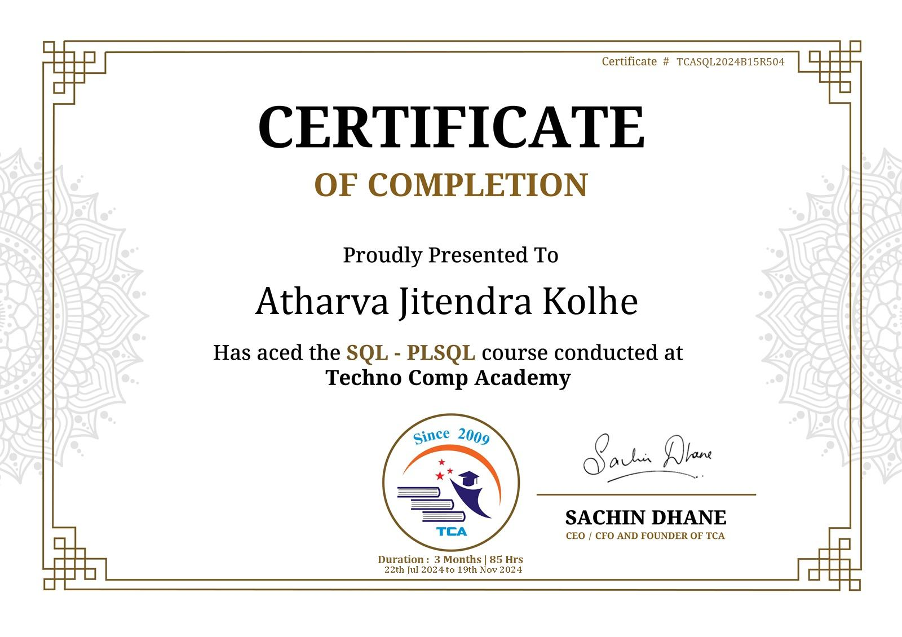
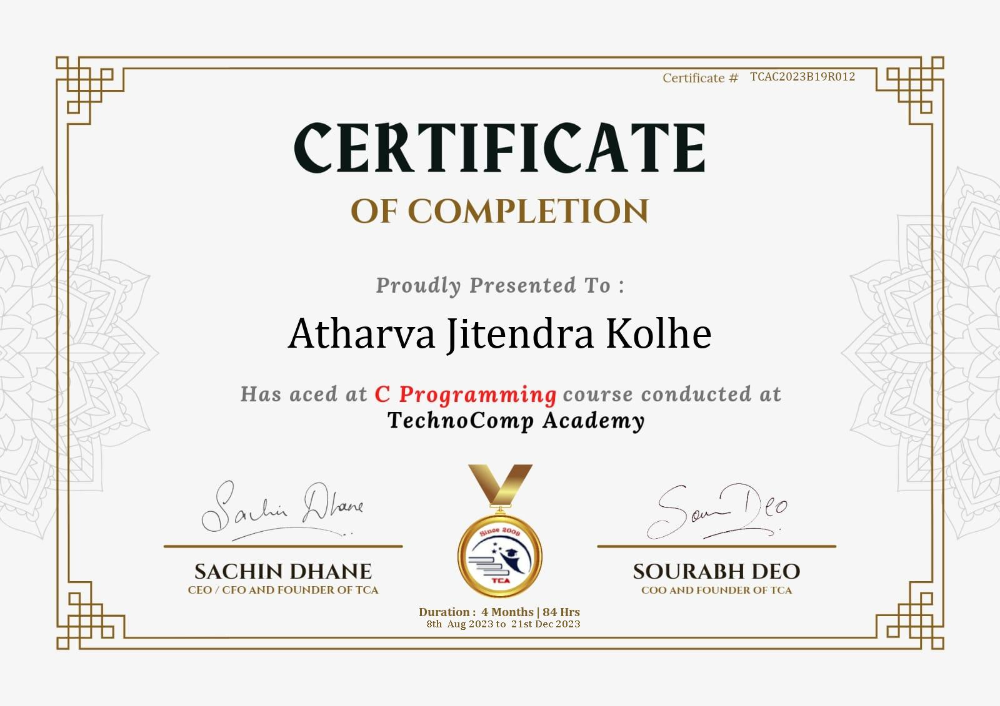
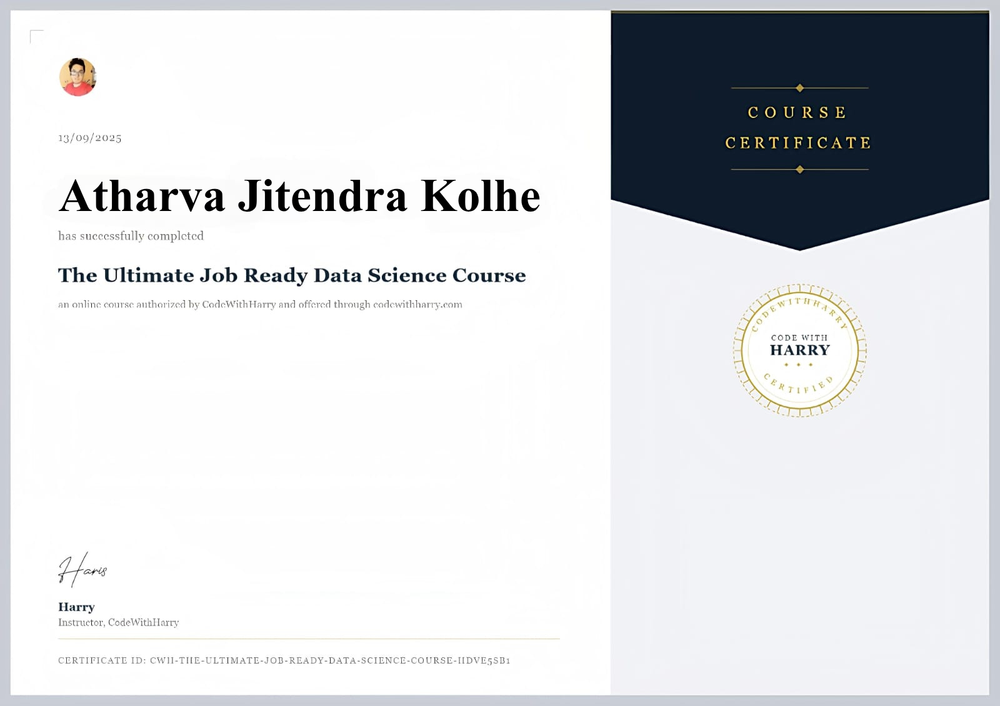

<div align="center">


<br/>


<br/><br/>


<br/><br/>

<a href="https://atharvakolhe.netlify.app/">

</a>

<a href="https://www.linkedin.com/in/atharva-kolhe-a17837279">

</a>

<a href="mailto:hardikkolhe07@gmail.com">

</a>

<a href="https://github.com/Softwiz321">

</a>

<br/><br/>


</div>

---

# 👨‍💻 About Me

I'm **Atharva J. Kolhe**, an aspiring **Data Science & AI/ML Engineer** currently pursuing **M.Sc. in Computer Science**. I enjoy designing intelligent software systems that combine data, machine learning, and modern software engineering practices to solve real-world problems.

My interests span the complete AI development lifecycle—from collecting and processing data to training models, deploying applications, and continuously improving performance.

I have internship experience in AI/ML and Data Science, where I've worked on practical projects involving Python, machine learning, data analytics, automation, and application development.

### What I Do

- Build AI & Machine Learning applications
- Develop data-driven software solutions
- Create Python automation tools
- Work with SQL & database systems

### Currently

- 🎓 Pursuing **M.Sc. Computer Science**
- 🤖 Learning **Advanced AI/ML**
- 📊 Building **Data Science Projects**
- 🌐 Developing **AI Applications**
- 🚀 Looking for **AI/ML & Data Science Internship Opportunities**

---

## 🎯 Open To

- AI / ML Internship
- Data Science Internship
- Software Engineering Internship
- Open Source Collaboration
- Research Opportunities

---
# ⚡ Tech Stack

<div align="center">

## 💻 Programming Languages

<p>

</p>

## 🌐 Frontend Development

<p>

</p>

## ⚙️ Backend Development

<p>

</p>

## 🗄️ Databases

<p>

</p>

## ☁️ Cloud • DevOps • Tools

<p>

</p>

## 📊 Data Science & AI

<p>


</p>

</div>

---

# 🤖 AI / ML Expertise

| Domain | Proficiency | Details |
|:-------|:-----------:|:--------|
| Machine Learning | ⭐⭐⭐⭐☆ | Supervised & Unsupervised Learning, Model Evaluation |
| Data Science | ⭐⭐⭐⭐☆ | Data Cleaning, Feature Engineering, Visualization |
| Artificial Intelligence | ⭐⭐⭐⭐☆ | Intelligent Systems & Practical AI Applications |
| Python Programming | ⭐⭐⭐⭐⭐ | Automation, APIs, Data Processing |
| Data Analytics | ⭐⭐⭐⭐☆ | Business Insights & Dashboard Development |
| SQL / PL-SQL | ⭐⭐⭐⭐☆ | Query Optimization & Database Design |
| Deep Learning | ⭐⭐⭐☆☆ | Neural Networks, TensorFlow Fundamentals |
| Generative AI | ⭐⭐⭐☆☆ | LLMs, Prompt Engineering, AI Tools |
| Web Development | ⭐⭐⭐☆☆ | MERN Stack & Python Frameworks |

---

# 📚 Core Technical Skills

<table>

<tr>

<td width="50%">

### Artificial Intelligence

- Machine Learning
- Deep Learning
- Data Mining
- Predictive Analytics
- NLP Basics
- Model Evaluation

</td>

<td width="50%">

### Data Science

- Data Cleaning
- Exploratory Data Analysis
- Feature Engineering
- Visualization
- Statistical Analysis
- Business Insights

</td>

</tr>

<tr>

<td>

### Software Engineering

- Object-Oriented Programming
- Git & GitHub
- Debugging
- Code Optimization

</td>

<td>

### Databases

- MySQL
- MongoDB
- SQL
- PL/SQL
- Database Design
- Query Optimization

</td>

</tr>

</table>

---

# 🧰 Development Environment

| Category | Technologies |
|-----------|--------------|
| IDEs | VS Code, Jupyter Notebook |
| Version Control | Git, GitHub |
| Backend | Flask, Django |
| Frontend | HTML, CSS, JavaScript|
| Database | MySQL, MongoDB |
| AI Libraries | NumPy, Pandas, Scikit-learn, TensorFlow |
| Visualization | Power BI, Matplotlib |
| Deployment | Netlify, GitHub |

---

# 🎯 Areas of Interest

<div align="center">

| AI & ML | Data Science |
|---------|--------------|
| Machine Learning | Data Analytics |
| Deep Learning | Data Visualization |
| NLP | Business Intelligence |
| Computer Vision | Dashboarding |

</div>

---
# 🚀 Featured Projects

<details open>
<summary><b>📊 SEO Automated Analyzer</b></summary>

## Overview

An interactive Business Intelligence dashboard developed in Power BI to monitor and analyze website SEO performance. The dashboard integrates data from Google Search Console, Google Analytics 4, and BigQuery, transforming raw SEO metrics into actionable business insights through DAX calculations and interactive visualizations.

| Category | Details |
|-----------|---------|
| **Tech Stack** | Power BI, DAX, Power Query, Google Search Console, Google Analytics 4, BigQuery |
| **Domain** | SEO Analytics & Business Intelligence |
| **Features** | Keyword Rankings, CTR Analysis, Impressions, Backlinks, Core Web Vitals |
| **Visualization** | Interactive Dashboards & KPI Reports |
| **Impact** | Enables data-driven SEO monitoring and performance optimization |

### Key Features

- Interactive SEO dashboard
- Advanced DAX calculations
- Power Query data transformation
- Keyword ranking analysis
- CTR and impressions tracking
- Core Web Vitals monitoring
- Performance KPI visualization

</details>

---

<details>
<summary><b>❤️ Heart Disease Analysis Dashboard</b></summary>

## Overview

A healthcare analytics dashboard built using Power BI to analyze patient demographics, clinical indicators, and heart disease risk factors. The project provides meaningful insights through interactive reports and data visualizations that support healthcare decision-making.

| Category | Details |
|-----------|---------|
| **Tech Stack** | Power BI, DAX, Power Query, Excel |
| **Domain** | Healthcare Analytics |
| **Visualization** | Interactive Dashboard |
| **Features** | Patient Analysis, KPI Dashboard, Risk Factor Analysis |
| **Impact** | Supports data-driven healthcare insights through visual analytics |

### Key Features

- Patient demographic analysis
- Heart disease risk visualization
- Interactive reports
- DAX measures
- KPI dashboard
- Data-driven healthcare insights

</details>

---

<details>
<summary><b>🌐 Web Scraping & Data Analysis</b></summary>

## Overview

A Python-based data collection pipeline that automates web scraping, cleans and transforms extracted information, and prepares structured datasets for further analysis and visualization using industry-standard data science libraries.

| Category | Details |
|-----------|---------|
| **Tech Stack** | Python, BeautifulSoup, Requests, Pandas |
| **Domain** | Data Collection & Analysis |
| **Automation** | Web Scraping Pipeline |
| **Features** | Data Cleaning, Transformation, CSV Export |
| **Impact** | Automates manual data collection and improves data availability for analytics |

### Key Features

- Automated web scraping
- Data extraction
- Data preprocessing
- Data cleaning
- CSV export
- Structured dataset generation
- Analytics-ready output

</details>

---

<details>
<summary><b>📧 Email Spam Detection using Machine Learning</b></summary>

## Overview

A machine learning project that classifies emails as spam or legitimate using Natural Language Processing techniques, TF-IDF vectorization, and supervised learning algorithms to improve email filtering accuracy.

| Category | Details |
|-----------|---------|
| **Tech Stack** | Python, Scikit-learn, Pandas, NumPy, TF-IDF |
| **Domain** | Machine Learning & NLP |
| **Algorithms** | Text Classification |
| **Features** | Spam Detection, Feature Extraction, Model Evaluation |
| **Impact** | Demonstrates practical application of NLP in email classification |

### Key Features

- Text preprocessing
- TF-IDF vectorization
- Spam classification
- Feature engineering
- Model evaluation
- Performance metrics
- Prediction pipeline

</details>

---

<details>
<summary><b>🌐 Personal Portfolio Website</b></summary>

## Overview

A modern, responsive portfolio website developed using React and Tailwind CSS to showcase projects, technical skills, internships, certifications, education, and professional achievements through a clean and interactive user interface.

| Category | Details |
|-----------|---------|
| **Tech Stack** | React, Vite, Tailwind CSS |
| **Deployment** | Netlify |
| **Architecture** | Single Page Application (SPA) |
| **Features** | Responsive Design, Smooth Animations, Interactive UI |
| **Purpose** | Professional Portfolio & Personal Branding |
| **Website** | https://atharvakolhe.netlify.app |

### Key Features

- Modern responsive design
- Interactive project showcase
- Technical skills section
- Certification gallery
- Contact form integration
- Smooth scrolling navigation
- Professional UI/UX

</details>

---

# 💼 Experience

## Data Science Intern — Athenura 

**Duration:** April 2026 - Present

Worked on practical Data Science , Artificial Intelligence and Machine Learning projects while gaining industry exposure to modern software development workflows.

### Responsibilities

- Developed AI & ML based solutions
- Worked with Python programming
- Data preprocessing and feature engineering
- Model evaluation
- Software development best practices
- Team collaboration

**Skills**

`Python` `Machine Learning` `Artificial Intelligence`
`Data Science`
`Git` 
`Problem Solving`

---

## Data Science Intern — Oasis Infobyte

**Duration:** 2 Months

Worked on Data Science projects involving data analysis, visualization, and machine learning fundamentals.

### Responsibilities

- Data cleaning
- Exploratory Data Analysis
- Machine Learning implementation
- Visualization
- Python development
- Report generation

**Skills**

`Python`
`Pandas`
`NumPy`
`Scikit-learn`
`Machine Learning`
`Data Analysis`

---

# 🏆 Achievements

<div align="center">

| Recognition | Details |
|--------------|---------|
| 🎓 Education | Pursuing M.Sc. Computer Science |
| 💼 Internship Experience | 6 Months of AI/ML & Data Science Internship Experience |
| 🤖 AI Projects | Built AI-powered applications and intelligent automation tools |
| 📊 Data Engineering | Developed automated data collection and processing pipelines |
| 🌐 Portfolio | Professional developer portfolio deployed online |
| 🚀 Continuous Learning | Actively learning AI, ML, Full Stack Development & MLOps |

</div>

---

# 📜 Certifications

<div align="center">

## 🏛️ TechnoComp Academy

<table>
<tr>
<td align="center">
<br>
<b>Python Development with Data Migration</b>
</td>

<td align="center">
<br>
<b>SQL / PLSQL</b>
</td>
</tr>

<tr>
<td align="center">
<br>
<b>C Programming</b>
</td>

<td align="center">
<br>
<b>Data Science with AI/ML</b>
</td>
</tr>
</table>

</div>

---

# 🎯 Professional Strengths

- AI & Machine Learning Development
- Data Science & Analytics
- Python Programming
- SQL & Database Design
- Automation
- Problem Solving
- Software Engineering
- Continuous Learning

---

# 📈 GitHub Analytics

<div align="center">


</div>

<div align="center">


</div>

---

# 📊 Contribution Activity

<div align="center">


</div>

---

# 🎯 Current Focus

```yaml
learning:
  - Advanced Machine Learning
  - Deep Learning
  - Generative AI
  - MLOps
  - System Design

building:
  - AI-Powered Applications
  - Data Science Solutions
  - Full Stack Projects
  - Automation Pipelines

exploring:
  - Large Language Models (LLMs)
  - Cloud Technologies
  - Docker
  - Vector Databases

currently_working:
  - AI/ML Intern @ Athenura

open_to:
  - AI/ML Internship
  - Data Science Internship
  - Software Engineering Internship
  - Open Source Collaboration
```

---

# 🤝 Connect With Me

<div align="center">

<a href="mailto:hardikkolhe07@gmail.com">

</a>

<a href="https://www.linkedin.com/in/atharva-kolhe-a17837279">

</a>

<a href="https://github.com/Softwiz321">

</a>

<a href="https://atharvakolhe.netlify.app/">

</a>

</div>

---

<div align="center">

### *"Turning data into insights and ideas into intelligent solutions."*

<br/>


</div>
